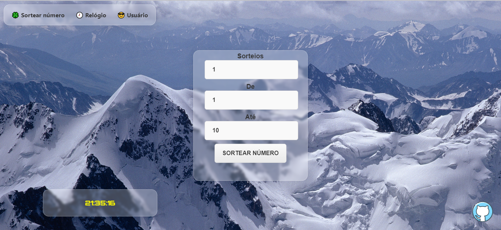

# 🍀 SORTEADOR DE NÚMEROS 🍀

## Um modelo de site feito em React para sortear números aleatórios.

versão: 221030

## Ajude-nos, a melhorar o site 🤩❤️ 

    FEITO POR: https://github.com/LucasATS
    IMAGENS DE FUNDO FORAM EXTRAIDOS DO SITE: wall.alphacoders.com

[🔗 ACESSE O PROJETO ](https://lucasats.github.io/Sorteador-de-numeros/)

> npm start
> npm run deploy

> Instale: npm install axios e npm i -D react-router-dom

## __🎯 METAS__
- [X] 🕗 Add relógio.
- [X] Remover bugs.
- [ ] Sortear nomes.
  - [x] Ler Json com nomes
- [X] SEO.
- [X] Adição de estilo e interface gráfica.
- [x] Montagem básica.

<!--
## __❤ AGRADECIMENTOS__
[@<NOME>](<LINK>) "<MENSAGEM>"
-->

## __🛠 TECNOLOGIAS__

## __😘 CONTATO__

  
  
  
   
    

